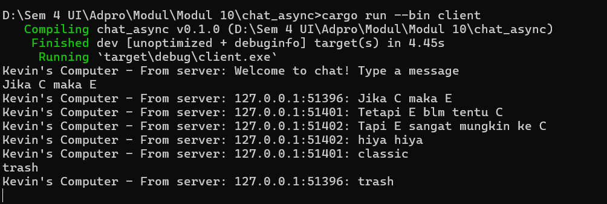
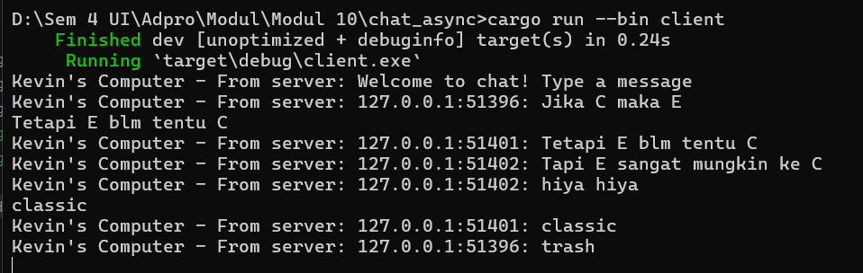
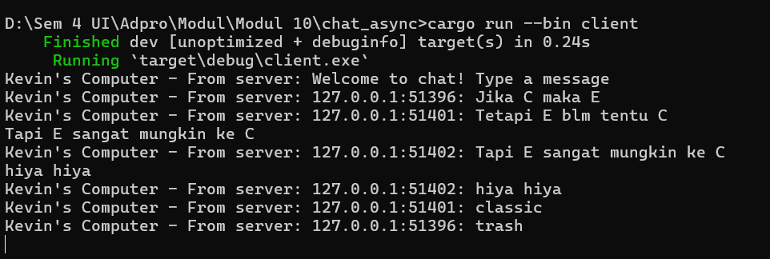

Modul 10 tutorial 2
 {
                        if let Some(text) = msg.as_text() {
                            println!("Kevin's Computer - From server: {}", text);
                        }
                    },

We modified it so we can display the sender information along with the message content.
This modification allows each client to show messages along with details about the sender, providing context about the origin of each message.

In the server side with modify 

                        println!("From client {addr:?} {text:?}");
                            let newChat = addr.to_string() + ": " + text;
                            bcast_tx.send(newChat.into())?;

we need to show information about the sender (in this case, the client's IP address and port) to the message before broadcasting it to all clients.
This modification ensures that each client receives messages along with details about who sent the message.

